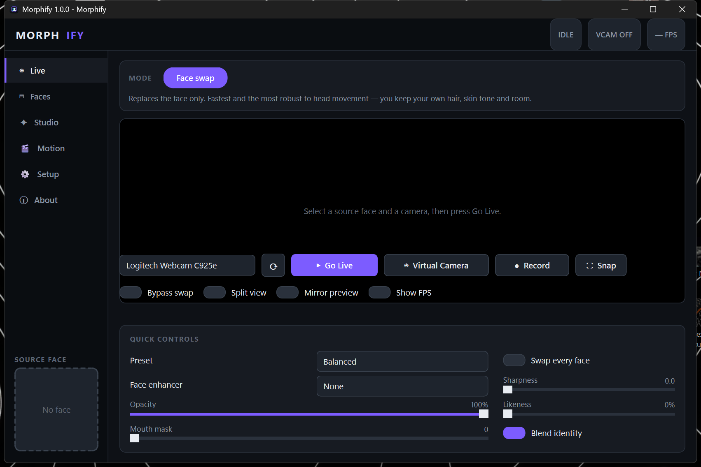
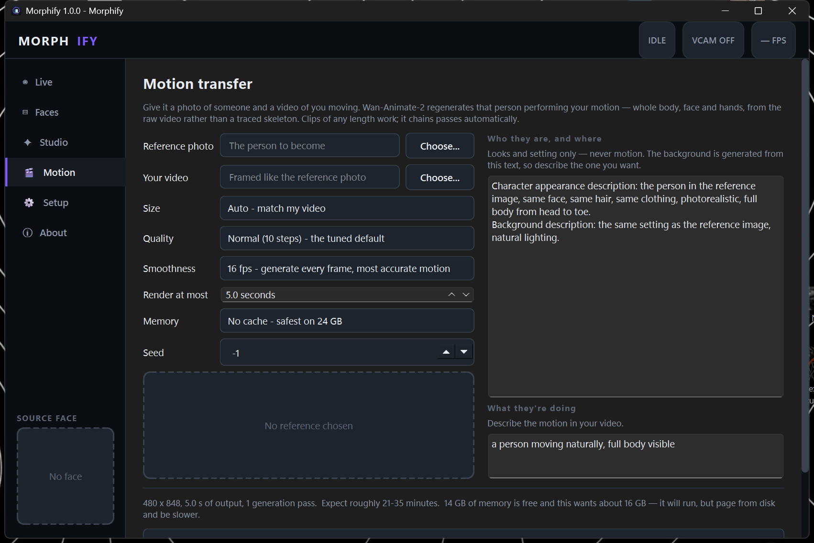

<h1 align="center">Morphify</h1>

<p align="center">
  <b>Real-time face swap that publishes back to your system as a webcam</b><br>
  plus offline whole-body motion transfer with a 14B video diffusion model.
</p>

<p align="center">
  <a href="#running-from-source">Run it</a> ·
  <a href="#what-it-does">Features</a> ·
  <a href="#engineering-notes">Engineering notes</a> ·
  <a href="#credits-and-licence">Licence</a>
</p>

---

Morphify turns your webcam feed into someone else's face and **publishes the
result back to the operating system as a camera device**, so Discord, Zoom,
Teams, OBS and any browser can select it like an ordinary webcam. It also
renders a still photo of a person performing motion from a video of you —
whole body, generated rather than pasted.

Built by **[IOMIOU](https://github.com/IOMIOU)** on top of the open-source
[Deep-Live-Cam](https://github.com/hacksider/Deep-Live-Cam) face-swap engine.

<p align="center">
  
</p>

<p align="center">
  
</p>

## What it does

**Live**

- **Virtual camera output.** The swapped feed is published as a system camera
  device. This is the headline feature and it did not exist upstream.
- ~31 fps at 960×540 on an RTX 3060, with cached detection, an ONNX Runtime
  CUDA-graph inference path, and a bounded drop-on-overflow frame pipeline so a
  slow consumer never stalls the swap loop.
- **Likeness** control, mouth masking, opacity, sharpness, a bypass ("panic")
  switch that drops the swap instantly without dropping the stream, and a
  before/after split view.
- Recording and snapshots.

**Faces**

- A searchable source-face library with favourites, rename and delete.
- **Find faces** searches Wikimedia Commons and Openverse with no API key,
  runs the face detector across every result, and lets you add the ones that
  actually contain a face in a click.
- **Identity blending** averages several photos of the same person into one
  identity, rejecting outliers so a mis-tagged photo cannot poison the group.
- Warns immediately when a source photo's face is too small to work.

**Motion transfer** (offline)

- A reference photo plus a video of you moving becomes that person performing
  your motion, using **Wan-Animate-2 14B** (distilled, int8) through a private
  ComfyUI backend that Morphify starts on demand.
- **Automatic length adaptation.** The model emits a fixed 81-frame block per
  pass; Morphify plans and chains as many passes as the clip needs, handling
  the temporal anchor and overlap trim itself. The reference workflow for this
  model makes you copy-paste a subgraph per block and rewire it by hand.
- Adjustable steps, automatic output resolution from your clip's aspect ratio,
  live progress with a calibrated time estimate, and H.264 output.

## Running from source

Requires Python 3.10, an NVIDIA GPU for realistic performance, and
[OBS Studio](https://obsproject.com) installed once for its virtual-camera
driver (OBS itself never has to run).

```bash
python -m venv venv
venv\Scripts\python.exe -m pip install -r requirements.txt
venv\Scripts\python.exe setup\download_models.py
venv\Scripts\python.exe run.py --execution-provider cuda
```

Check the install at any time — this is the fastest way to see what is wrong:

```bash
venv\Scripts\python.exe run.py --self-test
```

Motion transfer needs a separate ~23 GB model download and a ComfyUI backend;
see [`MORPHIFY.md`](MORPHIFY.md) for that setup.

Builds are not distributed here.

## Engineering notes

The interesting parts of this project were mostly measurement rather than code.
A few findings, all reproducible and documented in full in
[`MORPHIFY.md`](MORPHIFY.md):

- **A 3.8× speedup hiding in a build flag.** Motion transfer ran at 533 s per
  sampler step. The checkpoint is int8/convrot quantized and its fused CUDA
  kernels are silently disabled on CUDA 12.9 — the backend falls back to an
  unfused path. Rebuilding on cu130 took a step to **140 s**.
- **Pinned memory can be worse than no memory.** A 15.5 GB checkpoint on a
  24 GB machine, with weights pinned by default, made Windows page out
  everything else; free RAM fell to 1.8 GB and a single step never finished.
  Streaming from NVMe instead fixed it.
- **A silent off-by-one in frame chaining.** A continuation pass regenerates
  its anchor frame, so it advances by `length - 1`, not `length`. Getting this
  wrong raises nothing — it just stutters a little harder at every seam. Now
  covered by a regression test.
- **A strength control that could not work the obvious way.** inswapper
  normalises the latent it derives from the identity embedding, so *scaling*
  that embedding is a complete no-op. The Likeness control extrapolates its
  direction instead.
- **Face restoration makes identity worse, measured.** Upscaling a small source
  face with GFPGAN or GPEN scores *below plain bicubic* at every size across
  four identities — they invent a plausible generic face rather than recovering
  the real one. So Morphify warns instead of "enhancing".

Also fixed along the way: CUDA provider registration that only worked from one
entry point, a startup crash from a windowed build writing to a `None` stdout,
a `threading.Thread._stop` attribute collision, and an OpenCV writer producing
MPEG-4 Part 2 files that messaging apps reject.

`pytest` covers the planning, graph construction, identity maths and startup
safety — 143 tests.

## Responsible use

This is deepfake software. If you point it at a real person's face, that is a
consent question and in many jurisdictions a legal one. The upstream project's
NSFW check is kept wired in rather than stripped for performance. Do not use
this to impersonate people, to deceive, or to produce intimate imagery of
anyone without their explicit agreement.

## Credits and licence

Morphify is a derivative of
[Deep-Live-Cam](https://github.com/hacksider/Deep-Live-Cam) by hacksider and
its contributors, and is released under the same licence, the
**[AGPL-3.0](LICENSE)**. Credit for the underlying face-swap engine belongs to
that project.

What is added in Morphify: the virtual camera, the interface, the face library
and search, identity blending, motion transfer, the packaging and installer,
and the fixes listed above.

Models used: [InsightFace](https://github.com/deepinsight/insightface)
(`buffalo_l`, `inswapper_128`), [GPEN](https://github.com/yangxy/GPEN),
[GFPGAN](https://github.com/TencentARC/GFPGAN) and
[Wan-Animate-2](https://huggingface.co/Comfy-Org/Wan-Animate-2). Each remains
under its own licence and is not redistributed here.
